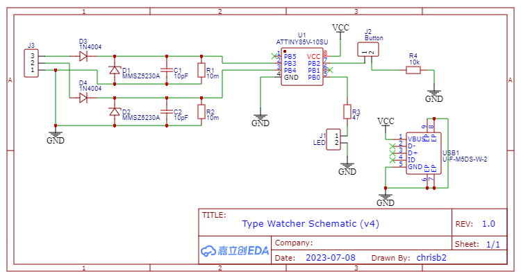
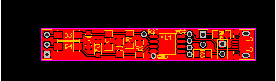
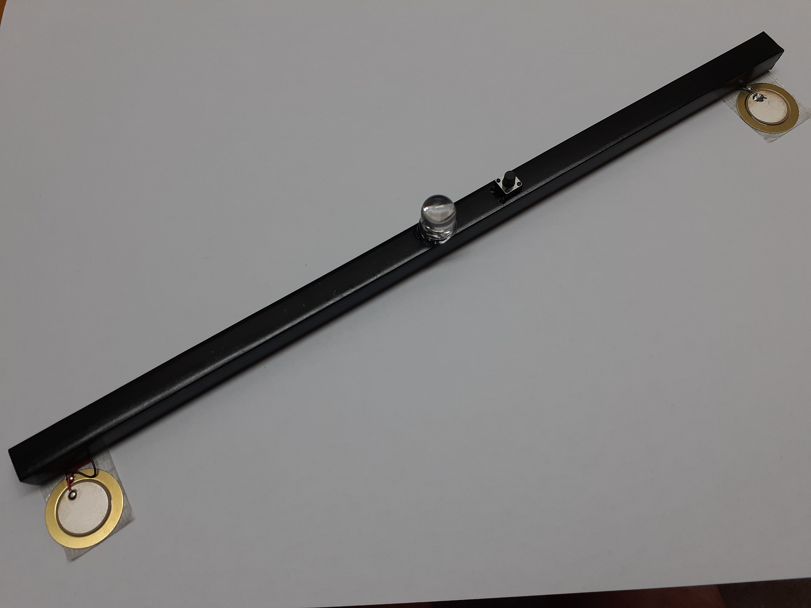

# type-watch
This project is based on an [ATtiny85](https://www.microchip.com/en-us/product/ATtiny85) MCU and uses two piezoelectric sensors under a keyboard to sense harsh typing and flashes a LED when a strong keystroke is detected. This feedback allows the user to train themselves to type gently, thus avoiding occupational overuse syndrome (OOS).

The program can use any MCU which supports the Arduino language.

The piezo sensors are [Sparkfun Piezo Elements](https://www.sparkfun.com/products/10293) and are connected at connector _J3_.

The Gerbers and BOM for the PCB are in the _gerbers_ directory.

The PCB is 55 * 8.3mm and is designed to fit inside a 9.5 * 9.5mm square PVC tube.

The piezoelectric sensors are placed under each back foot of the keyboard. 

The threshold can be adjusted between the limits in the program by pressing the button and is stored in EEPROM so that it persists over restarts.
